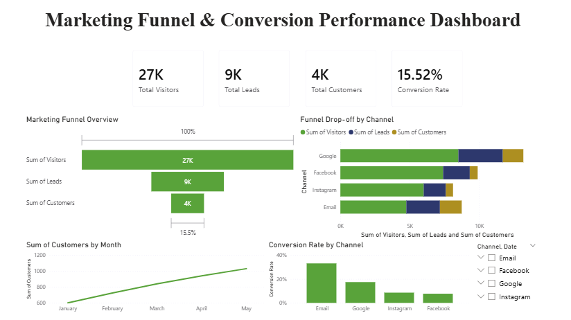

# Marketing Funnel & Conversion Performance Dashboard

## Objective  
To analyze marketing funnel data and identify conversion patterns, drop-off points, and opportunities to improve lead-to-customer conversion.

## Tools Used  
- Power BI  

## Key Insights  
- Significant drop-off occurs between visitors and leads stage  
- Email channel shows higher conversion despite lower traffic  
- Google generates high traffic and strong customer conversions  
- Instagram has moderate traffic but lower conversion efficiency  
- Conversion trends improve over time across channels  

## Recommendations  
- Optimize landing pages to improve visitor-to-lead conversion  
- Invest more in high-performing channels like Google and Email  
- Improve targeting strategy for low-performing channels  
- Focus on lead nurturing to increase final conversions  

## Outcome  
Developed a client-ready funnel dashboard providing actionable insights to improve marketing performance and increase conversions.

## Dashboard Preview  

